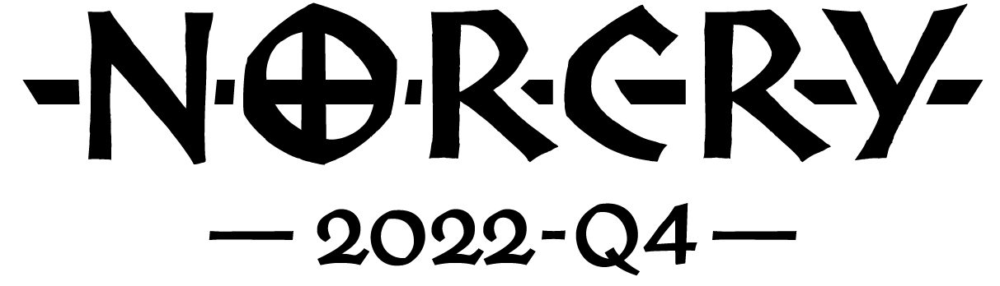

#

## A quarterly Warcry tournament held in Oslo

**Time:** Saturday November 19th, 1030-1800

**Place:** Midgard Gaming Studio, Ensjøveien 8, Oslo. Call 47279355 if
problems.

Sign-up: Free. Sign-up sheet below:

<https://forms.gle/8CbVWxesi67QWDGG9>

## Tournament overview

- Three Matched Play battles with scoring system. One objective mission,
one treasure mission and one kill mission.

- Models do not have to be painted, although we would love to see some
nice colors! There will be a prize for best painted warband.

### Schedule

|           |                                                      |
| --------- | ---------------------------------------------------- |
| 1030-1100 | Welcome/registration                                 |
| 1100-1245 | Round 1 (Treasure Hunters)                           |
| 1245-1345 | Lunch break (lunch not provided, 5 min walk to SPAR) |
| 1345-1530 | Round 2 (Ley Lines)                                  |
| 1530-1600 | Break                                                |
| 1600-1745 | Round 3 (Kill and Maim)                              |
| 1745-1800 | Wrap-up / prizes                                     |

## Tournament info

### Battleplans

|           |                                       |
| --------- | ------------------------------------- |
| *Round 1* | Treasure Hunters (new Core Book)      |
| *Round 2* | Ley Lines (new Core Book)             |
| *Round 3* | Kill and Maim(Tome of Champions 2020) |

Battleplans are included in the Appendix.

### Rules and list building

Rules and list-building guidelines for Matched Play apply, in short:
1000 points, and you can bring up to 3 heroes, 2 allies, 3 thralls and 1
monster.

Dagger, Shield and Hammer will be the same for all battles and must be
chosen prior to the tournament, so read the battleplans and choose
wisely.

Only fighters with stats/points from the new edition will be allowed.

### Scoring system

**Major Victory (20 pts):** Won the battle and less than half of the
fighters in your warband were taken down.

**Minor Victory (15 pts):** Won the battle but half or more of the
fighters in your warband were taken down.

**Draw (10 pts):** Drew the battle

**Minor loss (5 pts):** Lost the battle but half or more of the fighters
in your opponent’s warband were taken down.

**Major loss (0 pts):** Lost the battle and less than half of the
fighters in your opponent’s warband were taken down.

*Tournament winner* (highest total number of points) and *best painted
warband* (based on voting).

### Proxy models

Proxy models must be pre-approved. Contact Krister S. Karlsen (TO) to
get a proxy approved: <krister.karlsen@yahoo.no>.

## Appendix

### Battleplans

